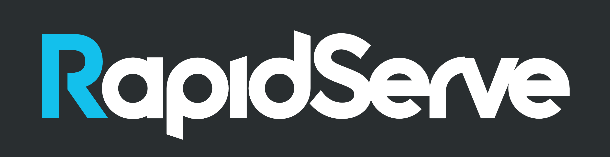

  

<h1 align="center">Awarded "Best use of MongoDB" at nwHacks 2020</h1>
<h3 align="center">Simple QR Code Bill Payment</h3>
<h4 align="center">nwHacks 2020 Hackathon Project</h4>
<h4 align="center">Main repository for the rapidserve application</h4>

### Useful Links
* [Github](https://github.com/rossmojgani/rapidserve)
* [DevPost](https://devpost.com/software/rapidserve-g1skzh)

### Team Members
* Ross Mojgani
* Dryden Wiebe
* Victor Parangue
* Aric Wolstenholme

### Description

RapidServe is a mobile application which allows restaurants to charge
their customers through a mobile application interface. Powered
with a React Native frontend and Python Flask API server with a
mongoDB database, RapidServe uses QR codes linked to tables to
allow the customer to scan the QR code at their table and pay for
any item at their table. Once all the items at the customers table
are paid for, the customer is free to go and the waiter/waitress
does not need to be bothered and wait for each customer at a
table to pay individually.

### Technical Details

* Frontend Mobile Application **(React Native)**
  * The frontend was implemented using React Native, there is a 
  landing page where the user can register or log in, using a
  facebook integration to link their facebook account.
  * While creating an account, if the user is a waiter/waitress, they are prompted
  to enter their restaurant ID, along with entering their username/password
  combination. If the user is a customer, they will just be prompted for
  a username/password combination. 
  * The page which comes up next is a page to scan a QR code which corresponds
  to the table which the waiter/waitress is serving or the customer is sitting at,
  the customer will be able to see which items have been charged to their table
  and pay for whichever items they need to. The waiter/waitress will be allowed
  to add items to the table they are serving.
  * The user can pay for their items and the waiter/waitress can see if the table
  has been paid for and know the customers are good to go.

* API Details **(Flask/Python API)**
  * The API for this application was implemented using the flask framework
  along with Python, there was documentation which the frontend used to
  make their HTTP requests, [API DOCUMENTATION](https://github.com/rossmojgani/rapidserve/blob/master/API.md),
  this API document was the contract between the frontend and the backend in
  terms of what arguments were sent into what type of HTTP requests. The API
  was hosted on a virtual machine in the cloud.
  * The API queried our mongoDB database based on which requests were being
  processed, which was also hosted on a virtual machine on the cloud, more below.

* Database Details **(MongoDB)**
  * The database used was mongoDB, which was queried from the Flask/Python
  server using PyMongo and Flask_PyMongo, we used two collections mainly,
  **users, and orders** which stored objects based on what a user needed to
  have stored (see [API DOCUMENTATION](https://github.com/rossmojgani/rapidserve/blob/master/backend/API.md)
  for a user object example) and for what a tables order would be (again, see [API DOCUMENTATION](https://github.com/rossmojgani/rapidserve/blob/master/API.md) for a table
  object example)
 
  
